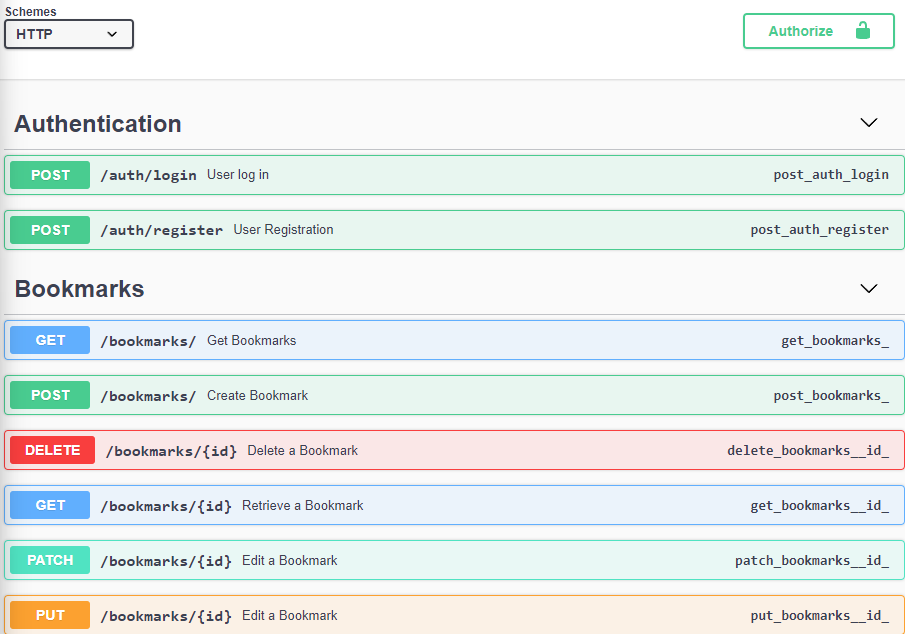

# Flask REST API



## Description
A REST API app built with Flask (for Bookmarks).

## Features 
- User Authentication
- Bookmarks Management (CRUD)

## Requirements
- Python 3.12
- Docker (for deployment)

## Installation 
1. Clone repo
```sh
     git clone https://github.com/francksharif/flask-rest-api
     cd flask-rest-api
```
2. Create a virtual environment and activate
```sh
python -m venv venv
source venv/bin/activate  # On Windows : venv\Scripts\activate
```

3. Install dependencies
```python
pip install -r requirements.txt
```

4. Configure .env 
```sh
SECRET_KEY=your_secret_key
JWT_SECRET_KEY=your_jwt_secret_key

```

5. Install database
```python
flask db init
flask db migration -m "initial migration"
flask db upgrade
```


## Run application
```python
flask run
```

## Deploy with Docker

1. Build image
```bash
docker build -t flask-api
```

2. Run container 
```bash
docker run -p 5000:5000 flask-api
```